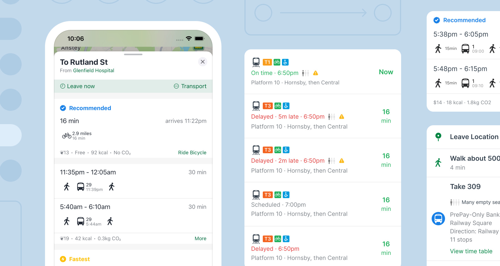

# Build smarter mobility in minutes

TripGo's REST API delivers door-to-door itineraries that blend public transit, micromobility, rideshare, taxi and walking - complete with live departure times, fares, emissions and accessibility flags.

Why developers ship with TripGo:

- **Free to start** — no credit card, generous trial limits
- **Ship fast** — open-source SDKs for Swift, Kotlin and React with ready-made UI components
- **Highly configurable** — personalise results for your users' needs
- **Top support** — responsive team + custom data integration

Grab your key, call `/routing.json`, and see real journeys before your coffee's done.



<div class="col-3">
  <div class="green-card">
    <div class="green-card-title">
      Uptime
    </div>
    <div class="green-card-value">
      100%
    </div>
  </div>
  <div class="green-card">
    <div class="green-card-title">
      Cities and regions
    </div>
    <div class="green-card-value">
      500+
    </div>
  </div>
  <div class="green-card">
    <div class="green-card-title">
      Transport providers
    </div>
    <div class="green-card-value">
      4,000+
    </div>
  </div>
</div>

## 1. Getting an API key

You can try it out for free for as long as you like, as long as you stay below a threshold of API calls - no credit card required. For limits on the free tier and pricing, see the [SkedGo website](https://skedgo.com/en/tripgo-api/pricing/).

It may take up to 5 minutes for your key to be active.

Once you have an API key, send it along with every request as the `X-TripGo-Key` header.

[Get an API key](https://tripgo.3scale.net/signup?plan_ids[]=2357356192718){: target="\_blank" .btn-primary }

## 2. Make a request

Our API can do a lot more than just [directions](/#tag/Routing%2Fpaths%2F~1routing.json%2Fget), but if that is what you are interested in, then try something like:

```
curl 'https://api.tripgo.com/v1/routing.json?from=(-33.859,151.207)&to=(-33.863,151.208)&departAfter=1532799914&modes=wa_wal&v=11&locale=en' -H 'Accept: application/json' --compressed -H "X-TripGo-Key: $tripgoKey" -g
```

or

```
curl 'https://api.tripgo.com/v1/routing.json?from=(-33.859,151.207)&to=(-33.891,151.209)&modes=pt_pub&v=11&locale=en' -H 'Accept: application/json' --compressed -H "X-TripGo-Key: $tripgoKey" -g
```

Keep in mind that this API is optimised to return a large number of trip results while maintaining small response sizes. This has a number of complications. Notably, to get a trip's segments you need to combine the segment references with the segment templates. This is explained further [in the F.A.Q.](faq/#trips-groups-frequencies-and-templates).

## 3. Integrating TripGo API with your App

SkedGo offers SDKs for iOS, Android, and React, making it easy to integrate trip planning features into your application. Below you’ll find quick-start examples for each platform. Be sure to replace the placeholder API key with your own.

=== "iOS"
    In your app delegate, provide your API key and start a new session:
    ```swift
    import TripKit

    func application(_ application: UIApplication, didFinishLaunchingWithOptions launchOptions: [UIApplication.LaunchOptionsKey: Any]?) -> Bool {

      TripKit.apiKey = "MY_API_KEY"
      TripKit.prepareForNewSession()

      // ...
    }
    ```
    You can then start using TripKit and TripKitUI, e.g.:
    ```swift
    import TripKitUI

    let controller = TKUIHomeViewController()
    present(controller, animated: true)
    ```
    [Learn more](https://ios.developer.tripgo.com/){ .btn-primary }
=== "Android"
    ```kotlin
    class App : Application() {
      override fun onCreate() {
        super.onCreate()
        TripKitConfigs.builder().context(this)
          .debuggable(true)
          .key { "YOUR_API_KEY" }
          .build()
        // Initialize TripKit here
      }
    }
    ```
    [Learn more](https://android.developer.tripgo.com/){ .btn-primary }

=== "React"
    **Installation**

    ```
    npm install tripkit-react
    ```

    Then pass TripGo API key to the
    [TKRoot component](reference/#/Components%20API/TKRoot) through the [config object](reference/#/Model/TKUIConfig).


    ```
    import React from 'react';
    import { createRoot } from 'react-dom/client';
    import { TKRoot, TKUITripPlanner } from 'tripkit-react';

    const config = {
        apiKey: <MY_TRIPGO_API_KEY>
    };

    const root = createRoot(document.getElementById('root'));

    root.render(
      <TKRoot config={config}>
        <TKUITripPlanner />
      </TKRoot>);
    ```
    [Learn more](https://react.developer.tripgo.com/){ .btn-primary }

## 4. Where to go from here?

1. If you're an app developer, take a look at our open source TripKit **SDKs for [Swift (iOS, macOS, Linux)](https://ios.developer.tripgo.com), and [Kotlin / Java (Android)](https://android.developer.tripgo.com)**.

2. If you're a web developer, take a look at our **[React SDK](https://react.developer.tripgo.com/)**, or check out our **[Leaflet Plugin](https://github.com/skedgo/leaflet.tripgo.routing)** (see [Demo](https://skedgo.github.io/leaflet.tripgo.routing/)).

3. If you're a backend developer, dive into the [**API specs**](/specs), which are available in OpenAPI (formerly Swagger) format. <!-- 4. Continue reading with our [in-depth **guides**](guides). -->

4. If you know how to debug a web app, look at the network activity for [our web app](https://tripgo.com/) to get an idea of which API calls to use when. (Filter for "satapp".)

